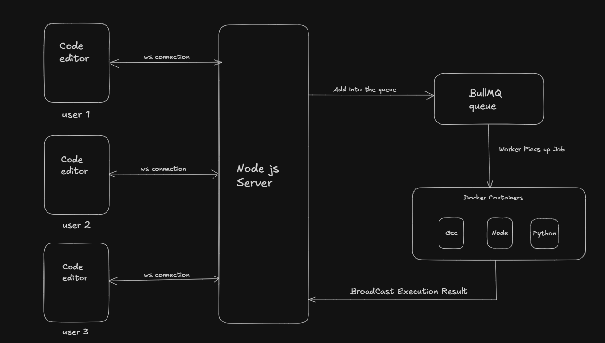

# Kyzen

A real-time collaborative code execution engine. Think Google Docs meets LeetCode — multiple users can write code together in a shared room and execute it instantly in isolated sandboxed environments.

---

## Demo

> 📹 [Watch Demo Video](Demp.mp4) 

---

## Architecture

> 📊 [Architecture Diagram]


---

## Features

- **Real-time collaborative editing** — multiple users edit the same code simultaneously with live cursor presence and username labels (powered by Yjs CRDT)
- **Sandboxed code execution** — each run spawns an isolated Docker container with strict resource limits (128MB memory, 50% CPU, no network access, PID limit)
- **Multi-language support** — Python, JavaScript, C++
- **Execution queue** — BullMQ + Redis prevents server overload by controlling execution concurrency
- **Live user presence** — see who's in the room with colored cursors and usernames
- **Language sync** — language selection syncs across all users in real time
- **Room-level execution lock** — Run button disables for all users while code is executing

---

## Tech Stack

**Backend**
- Node.js + TypeScript
- WebSockets (`ws`)
- Dockerode (Docker SDK for Node.js)
- BullMQ + Redis (execution queue)
- Express

**Frontend**
- React + TypeScript
- Monaco Editor (`@monaco-editor/react`)
- Yjs + y-monaco (CRDT collaborative editing)
- y-protocols (awareness/cursor presence)
- Tailwind CSS
- React Router

---

## System Design
↓ WebSocket

Node.js Server

↓ BullMQ Job

Redis Queue

↓ Worker picks up job

Docker Container (isolated per execution)

↓ stdout stream

Node.js Worker

↓ WebSocket broadcast

All clients in room

---

## Getting Started

### Prerequisites
- Node.js 18+
- Docker Desktop running
- Redis (via Docker: `docker run -d -p 6379:6379 redis`)

### Installation

```bash
# Clone the repo
git clone https://github.com/vishxl11/kyzen
cd kyzen

# Install server dependencies
cd server
npm install

# Install client dependencies
cd ../client
npm install
```

### Running locally

```bash
# Terminal 1 — start server
cd server
npm run dev

# Terminal 2 — start client
cd client
npm run dev
```

Open `http://localhost:5173`, enter a username, create or join a room.

---

## Security

Each code execution runs in a Docker container with:
- `--memory=128m` — memory cap
- `--cpus=0.5` — CPU throttle
- `--network=none` — no internet access
- `--pids-limit=50` — fork bomb prevention
- 10 second hard timeout

---

## License

MIT